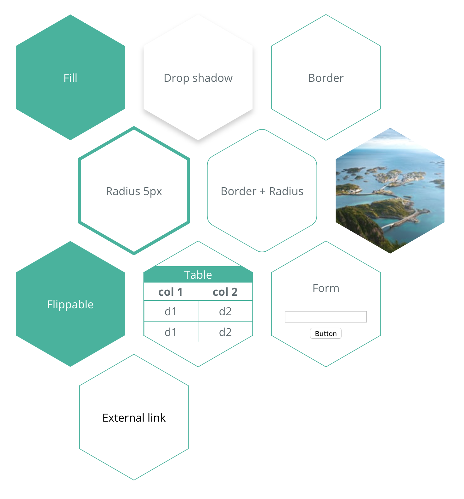

# react-svg-hexagons

React-svg-hexagons is a set a React components to help you manage hexagons inside your applications.

- [React-svg-hexagon](./packages/react-svg-hexagon)
- [React-svg-hexagon-flip](./packages/react-svg-hexagon-flip) to build flippable hexagons
- [React-svg-hexagon-grid](./packages/react-svg-hexagon-grid) to build responsible CSS grid of hexagons

## Example

## Getting started

Please refer to individual packages mentioned above for more explanations.

## Contributing

- ⇄ Pull/Merge requests and ★ Stars are always welcome.
- For bugs and feature requests, please [create an issue][github-issue].
- Pull requests must be accompanied by passing automated tests (`yarn test`).

See [CONTRIBUTING.md](../../CONTRIBUTING.md) guidelines.

## License

This project is licensed under the MIT License - see the [LICENCE.md](../../LICENCE.md) file for details.
