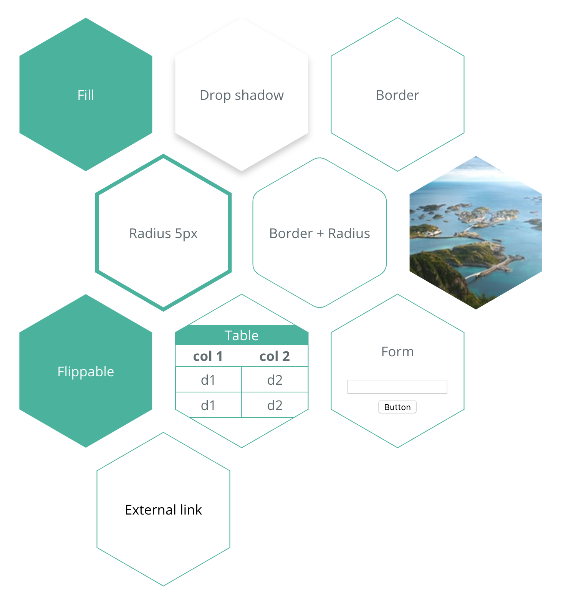

# react-svg-hexagon-grid

[![npm package][npm-badge]][npm]
[![Travis][build-badge]][build]
[![Codecov][codecov-badge]][codecov]
![Module formats][module-formats]

A React component to render a responsive CSS grid of SVG hexagons.

HexagonGrid can contain [Hexagon](../react-svg-hexagon) and [Hexagon-flip](../react-svg-hexagon-flip) components and every hexagon must have same height and width.

## Example



## Getting started

You can download `react-svg-hexagon-grid` from the NPM registry via the `npm` or `yarn` commands

```shell
yarn add react-svg-hexagon-grid
# or
npm install react-svg-hexagon-grid --save
```

If you don't use package manager and you want to include `react-svg-hexagon-grid` directly in your html, you could get it from the UNPKG CDN or from the local UMD build.

```html
<script src="https://unpkg.com/react-svg-hexagon-grid/dist/react-svg-hexagon-grid.min.js"></script>
<!-- or -->
<script src="node_modules/react-svg-hexagon-grid/dist/react-svg-hexagon-grid.min.js"></script>
```

## Usage

```javascript
import React from "react"
import Hexagon from "react-svg-hexagon"
import HexagonFlip from "react-svg-hexagon-grid"
import HexagonGrid from "react-svg-hexagon-grid"

const App = () => (
  <HexagonGrid>
    <Hexagon />
    <Hexagon />
    <Hexagon />
    <Hexagon />
    <Hexagon />
    <Hexagon>{/* Content */}</Hexagon>
    <HexagonFlip>
      <Hexagon>{/* Recto content */}</Hexagon>
      <Hexagon>{/* Verso content */}</Hexagon>
    </HexagonFlip>
  </HexagonGrid>
)
```

## Props

| Name | PropType         | Description                   | Default |
| ---- | ---------------- | ----------------------------- | ------- |
| gap  | PropTypes.number | Gap in pixel between hexagons | 30      |

## Contributing

- ⇄ Pull/Merge requests and ★ Stars are always welcome.
- For bugs and feature requests, please [create an issue][github-issue].
- Pull requests must be accompanied by passing automated tests (`yarn test`).

See [CONTRIBUTING.md](../../CONTRIBUTING.md) guidelines

## Changelog

See [CHANGELOG.md](./CHANGELOG.md)

## License

This project is licensed under the MIT License - see the [LICENCE.md](../../LICENCE.md) file for details

[npm-badge]: https://img.shields.io/npm/v/react-svg-hexagon-grid.svg?style=flat-square
[npm]: https://www.npmjs.org/package/react-svg-hexagon-grid
[build-badge]: https://img.shields.io/travis/xuopled/react-svg-hexagon-grid/master.svg?style=flat-square
[build]: https://travis-ci.org/xuopled/react-svg-hexagon-grid
[codecov-badge]: https://img.shields.io/codecov/c/github/xuopled/react-svg-hexagon-grid.svg?style=flat-square
[codecov]: https://codecov.io/gh/xuopled/react-svg-hexagon-grid
[module-formats]: https://img.shields.io/badge/module%20formats-umd%2C%20cjs%2C%20esm-green.svg?style=flat-square
[github-issue]: https://github.com/xuopled/react-svg-hexagon-grid/issues/new
